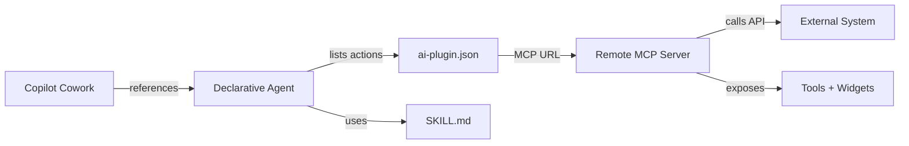
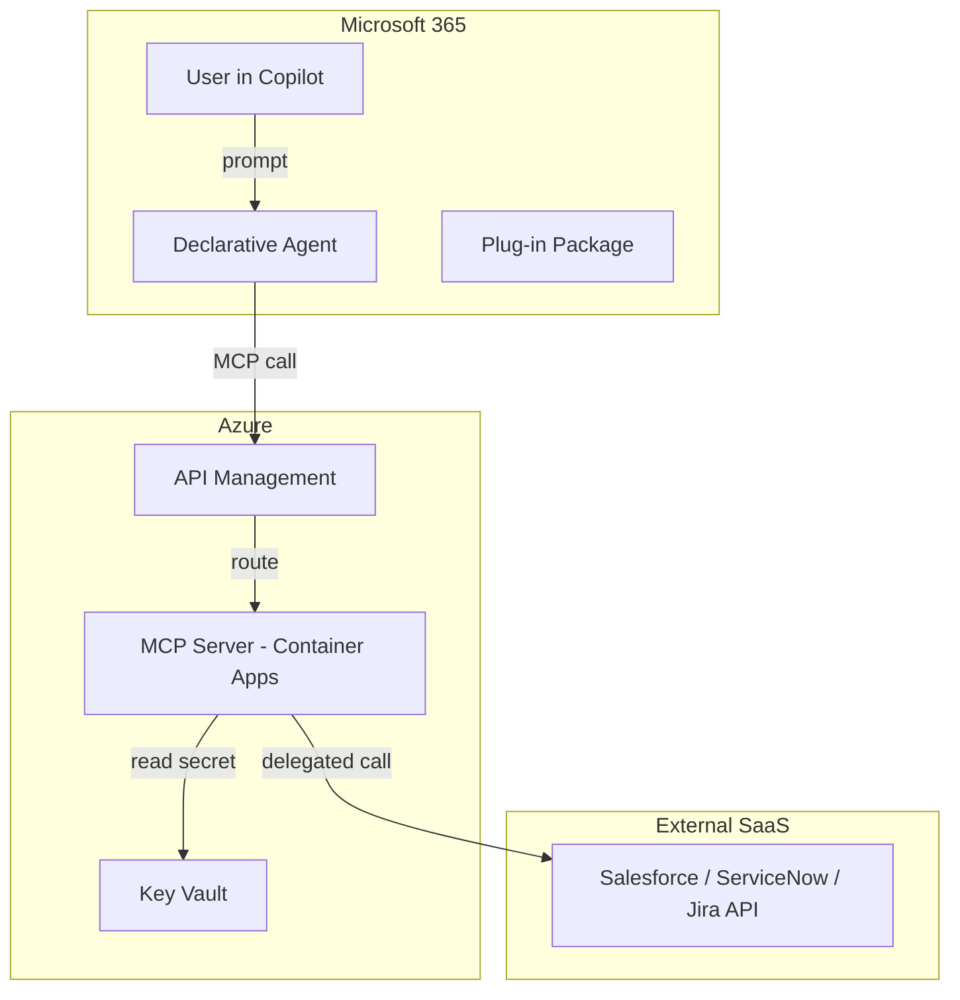
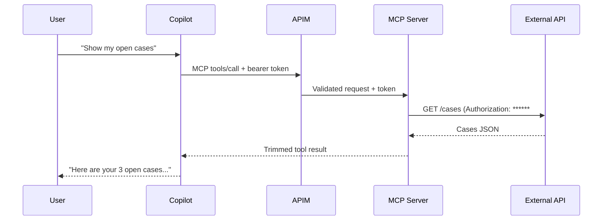
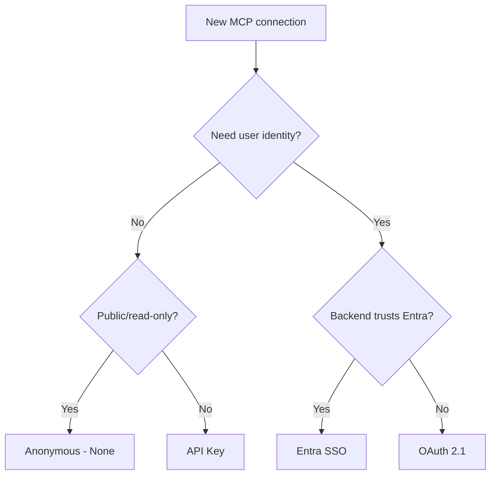

# Building Plug-ins for Copilot Cowork

A complete, beginner-first guide to extending Microsoft Copilot Cowork with MCP-based plug-ins. This textbook covers everything from concepts through production deployment, with worked examples for Salesforce, ServiceNow, and Jira Cloud.

---

## Before You Begin

### Learning goals

By the end of this chapter you will be able to:

- Define what Copilot Cowork is and how it differs from Copilot Chat
- Distinguish a plug-in from a skill and from a connector
- Explain MCP (Model Context Protocol) in one sentence
- List the jargon terms you will encounter throughout this guide
- Confirm you have the prerequisites to follow along

### What is Copilot Cowork?

Copilot Cowork is the part of Microsoft 365 Copilot that *does the work*. While regular Copilot chat answers questions and summarises documents, Cowork executes multi-step tasks on your behalf — updating CRM records, triaging incidents, preparing sprint summaries. You extend what Cowork can do by building **plug-ins**.

A plug-in is packaged with the same Microsoft 365 app model used for Teams apps and declarative agents. This means enterprise admins can deploy, govern, and audit your extension through familiar tooling.

### Plug-in versus skill

| Concept | Role | Analogy |
|---------|------|---------|
| **Plug-in** | The deployable package — the box that ships to an organisation | A mobile app in an app store |
| **Skill** | A reusable, instruction-based recipe inside the plug-in that tells Cowork *how* to accomplish a task | A recipe card in a cookbook |
| **Connector / action** | The live connection that lets the agent read and write data in an external system | A power cable plugging into the wall |

A plug-in can contain **skills** (the know-how) and **connectors** (the reach). Most production plug-ins pair both: a skill describes the workflow, and a connector supplies the live data the skill needs.

### MCP in one minute

**Model Context Protocol (MCP)** is a standard that tells an agent three things:

1. What tools are available?
2. What arguments does each tool accept?
3. Call this tool with these arguments — here is the result.

Instead of hand-coding a separate connector for every API, you build one MCP server and the agent discovers your tools dynamically.

### Jargon primer

| Term | One-line definition |
|------|---------------------|
| Copilot Cowork | Microsoft 365 Copilot's agentic execution surface |
| Plug-in | A deployable package containing an agent definition, skills, and actions |
| Declarative agent | The agent definition (instructions + knowledge + actions) inside the plug-in |
| Skill | A markdown recipe (SKILL.md) describing a reusable workflow |
| Connector / action | How the agent reaches an external system |
| MCP server | A remote service that exposes tools over Model Context Protocol |
| Tool | A callable operation a server exposes (name, typed args, description) |
| Streamable HTTP | The HTTPS transport a Cowork MCP connection uses |
| FastMCP | The Python SDK library for building MCP servers |
| Agents Toolkit | The VS Code extension (Microsoft 365 Agents Toolkit v6.3+) for building agents |
| UI widget / MCP app | An interactive card the server renders inside Copilot |

### What you need

Before continuing, ensure you have:

- **Python 3.11+** with `pip` or `uv`
- **Node.js 18+** (for the Agents Toolkit)
- **Visual Studio Code** with the Microsoft 365 Agents Toolkit extension (v6.3+, recommend 6.6.1+)
- **Azure subscription** (free tier works for learning)
- **Microsoft 365 developer tenant** with Copilot Cowork access (or a Microsoft 365 Copilot licence)
- **Git** and familiarity with the command line

> **Beginner note:** If you have never used Azure or Microsoft 365 admin tools, complete the free "Get started with Microsoft 365" learning path first.

### Concept check

**Q:** A colleague says "I'll just build a REST connector." What advantage does an MCP connection offer over a hand-built connector?

**A:** With an MCP connection you declare one action and the tools are discovered dynamically from the server. Adding capabilities is a server-side change — no connector rebuild needed. A hand-built REST connector needs a new operation defined and maintained for every API call and loses MCP's dynamic discovery and shared auth model.

### Chapter summary

- Copilot Cowork executes multi-step tasks — plug-ins extend what it can do.
- A plug-in bundles a declarative agent with skills (know-how) and connectors (reach).
- MCP standardises how the agent discovers and calls tools.
- You will build with Python (FastMCP), deploy on Azure, and integrate with Copilot Cowork.

---

## Quickstart

### Learning goals

By the end of this chapter you will be able to:

- Scaffold a new Cowork plug-in project using the Agents Toolkit
- Add an MCP server action to the plug-in
- Fetch tools from your MCP server into the action descriptor
- Choose an authentication mode
- Run and test the plug-in locally in Copilot

### Prerequisites

Ensure you have installed:

```bash
# Python dependencies
pip install "mcp[cli]" fastmcp uvicorn pydantic-settings

# Verify Agents Toolkit version
code --list-extensions | grep -i "TeamsDevApp.ms-teams-vscode-extension"
```

You also need VS Code with the Microsoft 365 Agents Toolkit (v6.3+ minimum, v6.6.1+ for MCP apps).

### Scaffold the project

Open VS Code and use the Agents Toolkit command palette:

1. **Create New Agent/App** → **Declarative Agent**
2. Give it a name, e.g. `cowork-demo-plugin`
3. The Toolkit scaffolds `manifest.json`, `declarativeAgent.json`, and a starter `ai-plugin.json`

### Add an MCP server action

4. In the Toolkit panel, choose **Add an Action** → **Start with an MCP Server**
5. Enter your MCP server URL (e.g. `http://localhost:8000/mcp` for local dev)
6. The Toolkit writes `.vscode/mcp.json` pointing at this URL

### Fetch tools from the server

7. Open `.vscode/mcp.json`, click **Start** in the Toolkit
8. Run the command **ATK: Fetch action from MCP** — it populates `ai-plugin.json` with your server's tools
9. Select which operations (tools) to expose to the agent

### Choose authentication

10. The Toolkit prompts for an auth type:
    - **None** — for dev/public read-only
    - **API key** — simple machine-to-machine
    - **OAuth 2.1** — recommended for enterprise (per-user delegated tokens)
    - **Microsoft Entra SSO** — when the backend trusts your M365 identity

For this quickstart, choose **None** (we will add OAuth later).

### Run it

11. **Provision** the app (Toolkit command: `ATK: Provision`)
12. **Sideload** at `https://m365.cloud.microsoft/chat`
13. Your agent appears with `dev` appended to its name
14. Test a prompt that exercises one of your tools

```text
You: "Show me my open Jira issues"
Agent: [calls jira_search tool] → Here are your 5 open issues…
```

### Recap

| Step | What happened |
|------|---------------|
| Scaffold | Agents Toolkit created the M365 app structure |
| Add action | Pointed the plug-in at your MCP server |
| Fetch tools | Toolkit discovered tools dynamically from the server |
| Choose auth | Selected how the connection authenticates |
| Run | Sideloaded and tested in Copilot |

> **Beginner note:** The whole flow takes under 10 minutes once your server is running. The rest of this guide teaches you to build that server, secure it, and deploy it to production.

### Hands-on lab

**Time:** 15 minutes
**Goal:** Complete the full scaffold-to-sideload flow with a hello-world MCP server.

1. Create a minimal MCP server:

```python
# server.py
from mcp.server.fastmcp import FastMCP

mcp = FastMCP("hello-cowork", stateless_http=True, json_response=True)

@mcp.tool()
def hello(name: str) -> str:
    """Say hello to the user."""
    return f"Hello, {name}! Welcome to Copilot Cowork."

if __name__ == "__main__":
    mcp.run(transport="streamable-http", host="0.0.0.0", port=8000)
```

2. Run it: `python server.py`
3. Follow steps 1–14 above to scaffold, fetch, and sideload.
4. Ask Cowork: "Say hello to me."
5. Confirm the tool was called and you see the greeting.

### Chapter summary

- The Agents Toolkit automates most of the scaffolding.
- You mostly write the MCP server (tools) and choose an auth mode.
- The plug-in discovers tools dynamically — adding tools is a server-side change.

---

## Concepts

### Learning goals

By the end of this chapter you will be able to:

- Describe what a Cowork plug-in contains and how it extends Copilot
- Tell a skill apart from a connector (and know when you need each)
- Name the 8 components of an MCP connection inside a plug-in
- Explain how Cowork discovers tools and widgets over streamable HTTP

### Plain-English intro

This chapter covers the handful of foundational ideas everything else builds on: how a Copilot Cowork plug-in is put together, the difference between a skill and a connector, and the components of the MCP connection that gives your plug-in reach into enterprise systems.

### What a plug-in contains

A plug-in package bundles three kinds of things:

1. **Declarative agent** — the agent definition: its name, instructions, conversation starters, and the list of actions it can take.
2. **Skills** — reusable, instruction-based recipes (a `SKILL.md`) that tell Cowork *how* to accomplish a task. Skills are the know-how.
3. **Connectors / actions** — how the agent reaches the outside world. A modern connector is an MCP server action — the reach.

### Skill versus connector

A **skill** is the *know-how*: a markdown recipe that describes the steps to complete a task ("to prepare a standup, gather my open issues, group them by status, and draft a summary"). A **connector** is the *reach*: the live connection that lets the agent actually read and change data in Jira, Salesforce, or ServiceNow.

| Use a skill when… | Use a connector when… |
|--------------------|-----------------------|
| You are describing a repeatable workflow or house style | You need live data or to take an action in a system |
| The steps are stable but the data changes each run | Permissions must match the signed-in user |
| No new API access is required | You must authenticate to an external service |

> **Tip:** A great plug-in pairs both: a skill describes the workflow, and the MCP connection behind a connector supplies the live data.

### The MCP connection

Model Context Protocol (MCP) is a standard way for an agent to discover and call tools. Instead of hand-coding one connector operation per API call, your plug-in points at a remote MCP server and Cowork asks it:

- What tools do you expose?
- What arguments does each tool accept?
- Call this tool with these arguments.

That is the MCP connection: the link between your plug-in and a server that speaks MCP.

### Components of the MCP connection (the 8 components)

This is the heart of plug-in extensibility. Every MCP connection inside a Cowork plug-in comprises these parts:

| # | Component | What it is | Lives in |
|---|-----------|-----------|----------|
| 1 | **Plug-in package / manifest** | Identity, name, icons, the declarative agent reference | `manifest.json` |
| 2 | **Declarative agent** | Instructions, conversation starters, and the list of actions | `declarativeAgent.json` |
| 3 | **Action descriptor** | Declares the MCP runtime: server URL, selected tools, auth reference | `ai-plugin.json` |
| 4 | **MCP server endpoint** | The remote HTTPS `/mcp` URL (streamable HTTP) | Your Azure host |
| 5 | **Tools** | The callable operations the server exposes that Cowork discovers | MCP server (Python) |
| 6 | **UI widgets (MCP apps)** | Interactive cards rendered in Copilot (optional) | MCP server |
| 7 | **Authentication binding** | How the connection proves identity (none, API key, OAuth 2.1, Entra SSO) | `ai-plugin.json` |
| 8 | **Dev pointer (`mcp.json`)** | Local pointer the Toolkit uses to start/fetch tools during development | `.vscode/mcp.json` |

> **Beginner note:** You do not write all of this by hand. The Microsoft 365 Agents Toolkit scaffolds the manifest, declarative agent, and `ai-plugin.json` for you, and fetches the tool list from your server. You mostly write the MCP server (the tools) and choose an auth mode.

### Tools

A **tool** is a callable function the server exposes to the agent. Its name, typed arguments, and description are all part of what Cowork discovers. Good tools do one clear thing and return a small, predictable object.

Example tool set (Jira connector):

| Tool | Purpose |
|------|---------|
| `jira_whoami` | Return the signed-in Jira user |
| `jira_search` | Search Jira with JQL |
| `jira_get_issue` | Return one trimmed issue |
| `jira_create_issue` | Create an issue |
| `jira_add_comment` | Add a comment to an issue |
| `jira_transition_issue` | Apply a workflow transition |

> **Tip — the golden rule of tool design:** A tool should do one clear thing and return a predictable, compact object.

### Streamable HTTP

A Cowork plug-in always connects to a remote MCP server over **streamable HTTP** — one HTTPS endpoint, usually `/mcp`, that accepts JSON-RPC-style requests.

Key settings when creating a FastMCP server:

| Setting | Meaning |
|---------|---------|
| `stateless_http=True` | Every request is self-contained — important behind gateways and load balancers |
| `json_response=True` | Return buffered JSON instead of a long-lived stream — gateway-friendly |

```python
from mcp.server.fastmcp import FastMCP

mcp = FastMCP("my-server", stateless_http=True, json_response=True)
```

Local `stdio` servers are fine while developing but are NOT a supported production Cowork connection.

### UI widgets (MCP apps)

A connection can do more than return text. With MCP apps, your server can return interactive UI widgets — for example a sprint board or an opportunity card — that render directly inside Copilot.

Widgets are optional. They need the Agents Toolkit 6.6.1+ and OAuth 2.1 or Entra SSO. Start text-only, then add widgets.

### How Cowork discovers tools (dynamic discovery)

Because the connection speaks MCP, Cowork discovers tools dynamically. You select which operations to expose once in the Agents Toolkit; after that, the agent learns the tool list from the server at runtime.

| MCP connection (dynamic) | Hand-built REST connector (static) |
|--------------------------|--------------------------------------|
| One action; tools discovered from the server | One connector operation per API call, maintained by hand |
| Add a tool on the server — it appears automatically | Every new capability means new connector work |
| Cowork treats it as an MCP tool source | Behaves like an ordinary REST connector |

### Diagram: Plug-in to MCP server flow

```text
┌──────────────────────────────────────────────────────────┐
│  Copilot Cowork                                          │
│  ┌─────────────────┐                                     │
│  │ Declarative Agent│──references──▶ ai-plugin.json      │
│  └────────┬────────┘               (action descriptor)   │
│           │                              │                │
│           ▼                              ▼                │
│     SKILL.md                    MCP Server URL            │
│  (know-how recipe)              (streamable HTTP)         │
│                                          │                │
└──────────────────────────────────────────┼────────────────┘
                                           │
                                           ▼
                                 ┌──────────────────┐
                                 │  Remote MCP Server│
                                 │  (Python/FastMCP) │
                                 │  ───────────────  │
                                 │  Tools + Widgets  │
                                 └──────────────────┘
                                           │
                                           ▼
                                 ┌──────────────────┐
                                 │ External System   │
                                 │ (Jira/SF/SNOW)   │
                                 └──────────────────┘
```



*Alt text: Flow from Copilot Cowork through the declarative agent and action descriptor to the remote MCP server, which calls the external system and exposes tools.*

### Concept check

**Q:** A teammate wants to "just add ten REST operations" to the plug-in instead of an MCP server. Why prefer the MCP connection?

**A:** With an MCP connection you declare one action and the tools are discovered dynamically, so adding capabilities is a server-side change. A hand-built REST connector needs a new operation defined and maintained for every call, and it loses MCP's dynamic discovery and shared auth model.

### Hands-on lab

**Time:** 10 minutes
**Goal:** Map a real-world integration to the 8 components.

Pick an enterprise system you use (e.g. GitHub, Confluence, or your internal HR tool). On paper or in a markdown file, fill in this table:

| Component | Your system's equivalent |
|-----------|--------------------------|
| Plug-in manifest | ? |
| Declarative agent | ? |
| Action descriptor | ? |
| MCP server endpoint | ? |
| Tools (list 3–5) | ? |
| UI widgets | ? |
| Auth binding | ? |
| Dev pointer | ? |

### Chapter summary

- A plug-in packages a declarative agent with skills (know-how) and connectors (reach).
- A connector reaches a system through an MCP connection — a remote MCP server exposed over streamable HTTP.
- The connection's 8 components are: manifest, declarative agent, action descriptor, server endpoint, tools, widgets, auth binding, and dev pointer.
- Cowork discovers tools dynamically, so new tools appear without rebuilding the connector.

---

## Architecture

### Learning goals

By the end of this chapter you will be able to:

- Draw the high-level architecture of a Cowork plug-in with an MCP connection
- Trace the request lifecycle from user prompt to external API call
- Explain how identity flows through the system
- Identify the three systems involved (Microsoft 365, Azure, external SaaS)

### High-level architecture

A production Cowork plug-in spans three systems:

1. **Microsoft 365 / Copilot** — where the user interacts with the agent, where the plug-in is registered, and where consent and governance happen.
2. **Azure** — where the MCP server runs (Container Apps or App Service), protected by APIM and Key Vault.
3. **External SaaS** — the system of record (Salesforce, ServiceNow, Jira) that the MCP server calls on behalf of the user.



*Alt text: Three-tier architecture showing Microsoft 365 (user + agent), Azure (APIM + MCP server + Key Vault), and External SaaS.*

### Request lifecycle

1. User types a prompt in Copilot Cowork
2. The declarative agent matches the intent to a skill or tool
3. Cowork sends an MCP `tools/call` request to the server URL (via APIM)
4. APIM validates the request and routes to the MCP server
5. The MCP server extracts the user's delegated token from the request context
6. The server calls the external API using that token
7. The response is trimmed (payload trimming) and returned as the tool result
8. Cowork presents the result to the user (text or widget)

### Identity flow

The critical security principle: the MCP server never stores user tokens. It receives a short-lived **delegated** token per request (via OAuth 2.1 or Entra SSO) that represents the signed-in user. This token is request-scoped, never logged, and never persisted.



*Alt text: Sequence diagram showing the identity flow from user through Copilot and APIM to the MCP server and external SaaS, with delegated tokens at each hop.*

### The three systems

| System | You control | You configure |
|--------|-------------|---------------|
| Microsoft 365 | Plug-in manifest, skills | Admin consent, governance policies |
| Azure | MCP server code, infra (Bicep) | APIM policies, Key Vault secrets, networking |
| External SaaS | Nothing (it is third-party) | OAuth app registration, scopes, redirect URIs |

> **Security note:** The Azure layer is your security boundary. APIM validates inbound requests, Key Vault stores client secrets, and the MCP server enforces least-privilege by requesting only the scopes it needs.

### Concept check

**Q:** Why does the MCP server not store user tokens between requests?

**A:** Tokens are request-scoped and delegated. Storing them would create a credential cache — a high-value target. Instead, each request carries a fresh token, the server uses it immediately, and it is discarded. This follows the principle of least privilege and reduces blast radius if the server is compromised.

### Chapter summary

- A Cowork plug-in architecture spans Microsoft 365, Azure, and the external SaaS.
- Requests flow from user → agent → APIM → MCP server → external API.
- Identity is delegated: short-lived, per-request tokens — never stored or logged.
- APIM + Key Vault form the security boundary in Azure.

---

## Environment

### Learning goals

By the end of this chapter you will be able to:

- Install all required software and verify versions
- Set up the Microsoft 365 Agents Toolkit in VS Code
- Confirm tenant access for sideloading
- Open and understand the project structure

### Required software

| Software | Minimum version | Purpose |
|----------|----------------|---------|
| Python | 3.11+ | MCP server development |
| Node.js | 18+ | Agents Toolkit runtime |
| VS Code | Latest | IDE |
| Agents Toolkit extension | 6.3+ (6.6.1+ for MCP apps) | Scaffolding, provisioning, sideloading |
| Azure CLI (`az`) | Latest | Azure resource management |
| Azure Developer CLI (`azd`) | Latest | Infrastructure deployment |
| Git | 2.x+ | Version control |

### Install commands

```bash
# Python (verify)
python --version  # Should show 3.11+

# Install MCP SDK and FastMCP
pip install "mcp[cli]" fastmcp uvicorn pydantic-settings httpx

# Node.js (verify)
node --version  # Should show 18+

# Azure CLI
curl -sL https://aka.ms/InstallAzureCLIDeb | sudo bash
az --version

# Azure Developer CLI
curl -fsSL https://aka.ms/install-azd.sh | bash
azd version
```

```powershell
# Windows equivalents
python --version
pip install "mcp[cli]" fastmcp uvicorn pydantic-settings httpx
node --version
winget install Microsoft.AzureCLI
winget install Microsoft.Azd
```

### Setting up the Agents Toolkit

1. Open VS Code
2. Go to Extensions (Ctrl+Shift+X)
3. Search for "Microsoft 365 Agents Toolkit" (publisher: Microsoft)
4. Install and reload
5. Verify: the Agents Toolkit icon appears in the Activity Bar

### Tenant access

You need a Microsoft 365 tenant where:

- You can sideload custom apps (developer tenant or admin-enabled tenant)
- The tenant has Copilot Cowork enabled (Microsoft 365 Copilot licence)
- You have a user account with appropriate permissions

> **Beginner note:** If you do not have a tenant, sign up for the Microsoft 365 Developer Program (free) and add the Copilot trial.

### Open the project

```bash
# Clone the starter template
git clone https://github.com/your-org/cowork-mcp-plugin-starter.git
cd cowork-mcp-plugin-starter

# Install Python dependencies
pip install -r requirements.txt

# Open in VS Code
code .
```

### Do / Avoid

| Do | Avoid |
|----|-------|
| Use Python 3.11+ for type hint support | Use Python 3.9 or older (missing features) |
| Keep Agents Toolkit updated to latest | Stay on old versions that lack MCP support |
| Use a dedicated dev tenant | Sideload into a production tenant without admin approval |
| Store secrets in `.env` (local) and Key Vault (prod) | Hard-code secrets in source code |

### Chapter summary

- Install Python 3.11+, Node.js 18+, VS Code, Agents Toolkit, Azure CLI, and azd.
- Ensure your tenant supports sideloading and has Copilot Cowork access.
- The project follows a standard structure with `src/`, `plugins/`, `infra/`, and `tests/`.

---

## Anatomy

### Learning goals

By the end of this chapter you will be able to:

- Tour every file in a Cowork plug-in project
- Understand what each of the 8 MCP connection components looks like on disk
- Read a `manifest.json`, `declarativeAgent.json`, and `ai-plugin.json`
- Identify what you write versus what the Toolkit generates

### The plug-in package

A complete plug-in project looks like this:

```text
my-plugin/
├── manifest.json                 # M365 app identity
├── declarativeAgent.json         # Agent definition
├── ai-plugin.json                # Action descriptor (MCP runtime)
├── SKILL.md                      # Skill recipe
├── .vscode/
│   └── mcp.json                  # Dev pointer to local MCP server
└── src/cowork_mcp/
    ├── server.py                 # FastMCP app
    ├── config.py                 # Settings
    ├── auth.py                   # Token handling
    ├── trim.py                   # Payload trimming
    └── connectors/
        ├── salesforce.py
        ├── servicenow.py
        └── jira.py
```

### manifest.json (Plug-in package / manifest)

```json
{
  "$schema": "https://developer.microsoft.com/json-schemas/teams/vDevPreview/MicrosoftTeams.schema.json",
  "manifestVersion": "devPreview",
  "version": "1.0.0",
  "id": "{{APP_ID}}",
  "name": { "short": "Cowork Plugin", "full": "My Cowork MCP Plugin" },
  "description": { "short": "MCP-based Cowork plugin", "full": "Extends Copilot Cowork with enterprise tools via MCP." },
  "icons": { "color": "color.png", "outline": "outline.png" },
  "developer": { "name": "Your Org" },
  "copilotAgents": {
    "declarativeAgents": [
      { "id": "agent", "file": "declarativeAgent.json" }
    ]
  }
}
```

**What this file does:** Defines the plug-in's identity (name, icons, version) and points to the declarative agent definition. This is the entry point of the M365 app model.

### declarativeAgent.json (Declarative agent)

```json
{
  "$schema": "https://aka.ms/json-schemas/copilot/declarative-agent/v1.2/schema.json",
  "version": "v1.2",
  "name": "Enterprise Helper",
  "description": "Helps with Jira, Salesforce, and ServiceNow tasks",
  "instructions": "You are a helpful enterprise assistant. Use the available tools to help users with their work. Always confirm before making changes.",
  "conversation_starters": [
    { "text": "Show my open Jira issues" },
    { "text": "Search for recent incidents in ServiceNow" },
    { "text": "Look up my Salesforce pipeline" }
  ],
  "actions": [
    { "id": "mcpAction", "file": "ai-plugin.json" }
  ]
}
```

**What this file does:** Defines what the agent knows, how it behaves, and which actions it can take. Edit the `instructions` and `conversation_starters` freely; the `actions` array links to the MCP connection.

### ai-plugin.json (Action descriptor)

```json
{
  "$schema": "https://aka.ms/json-schemas/copilot/plugin/v2.2/schema.json",
  "schema_version": "v2.2",
  "name_for_human": "Enterprise MCP Tools",
  "description_for_human": "Tools for Jira, Salesforce, and ServiceNow",
  "namespace": "enterprise",
  "runtimes": [
    {
      "type": "OpenApi",
      "auth": { "type": "OAuthPluginVault" },
      "spec": {
        "url": "https://my-mcp-server.azurecontainerapps.io/mcp"
      },
      "run_for_functions": [
        "jira_search", "jira_get_issue", "jira_create_issue",
        "salesforce_query", "salesforce_get_record",
        "servicenow_search_incidents"
      ]
    }
  ],
  "functions": [
    {
      "name": "jira_search",
      "description": "Search Jira issues using JQL",
      "parameters": {
        "type": "object",
        "properties": {
          "jql": { "type": "string", "description": "JQL query string" },
          "max_results": { "type": "integer", "description": "Maximum results to return", "default": 10 }
        },
        "required": ["jql"]
      }
    }
  ]
}
```

**What this file does:** Declares the MCP runtime — the server URL, the selected tools, and the authentication reference. The Toolkit populates the `functions` array when you run "ATK: Fetch action from MCP."

> **Beginner note:** You rarely edit `ai-plugin.json` by hand. The Toolkit fetches the tool list from your running server and writes this file for you.

### .vscode/mcp.json (Dev pointer)

```json
{
  "inputs": [],
  "servers": {
    "cowork-mcp": {
      "type": "http",
      "url": "http://localhost:8000/mcp"
    }
  }
}
```

**What this file does:** Tells the Agents Toolkit where to find your MCP server during development. This is dev-only — it is not part of the deployed plug-in.

### The MCP server (server.py)

```python
# src/cowork_mcp/server.py
from mcp.server.fastmcp import FastMCP
from .config import settings

mcp = FastMCP(settings.server_name, stateless_http=True, json_response=True)

# Tools are registered via decorators in connector modules
from .connectors import jira, salesforce, servicenow  # noqa: F401, E402

if __name__ == "__main__":
    mcp.run(transport="streamable-http", host="0.0.0.0", port=settings.port)
```

**What this file does:** Creates the FastMCP application and starts it on streamable HTTP. The connector modules register tools via decorators. Edit this file to change server settings; do not put business logic here.

### Component map

| Component | File(s) | Who creates it |
|-----------|---------|----------------|
| Manifest | `manifest.json` | Toolkit (you edit name/icons) |
| Declarative agent | `declarativeAgent.json` | Toolkit (you edit instructions) |
| Action descriptor | `ai-plugin.json` | Toolkit + fetch from server |
| MCP server | `src/cowork_mcp/server.py` | You |
| Tools | `src/cowork_mcp/connectors/*.py` | You |
| Widgets | `src/cowork_mcp/connectors/*.py` (optional) | You |
| Auth binding | `ai-plugin.json` (auth block) | Toolkit + you configure |
| Dev pointer | `.vscode/mcp.json` | Toolkit |

### Concept check

**Q:** Which files does the Agents Toolkit create for you, and which do you write from scratch?

**A:** The Toolkit creates `manifest.json`, `declarativeAgent.json`, `ai-plugin.json`, and `.vscode/mcp.json`. You write the MCP server (`server.py`), the connector modules (tools), and the skill (`SKILL.md`). You also configure the auth section in `ai-plugin.json` with the Toolkit's help.

### Chapter summary

- A plug-in project has a clear file-per-component structure.
- The Toolkit generates boilerplate; you focus on the MCP server and tools.
- The action descriptor (`ai-plugin.json`) is the bridge between the plug-in and the server.
- The dev pointer (`.vscode/mcp.json`) is local-only.

---

## Implementation

### Learning goals

By the end of this chapter you will be able to:

- Build a production-ready FastMCP server from scratch
- Implement request-scoped authentication
- Add payload trimming for Cowork's response-size limits
- Write connector modules with properly typed tools
- Package the plug-in manifest files

### Server setup (server.py)

```python
# src/cowork_mcp/server.py
"""FastMCP server for Copilot Cowork — streamable HTTP, stateless."""

from mcp.server.fastmcp import FastMCP
from .config import settings

mcp = FastMCP(
    settings.server_name,
    stateless_http=True,
    json_response=True,
)

# Import connectors to register their tools with the mcp instance
from .connectors import jira, salesforce, servicenow  # noqa: F401, E402

if __name__ == "__main__":
    mcp.run(transport="streamable-http", host="0.0.0.0", port=settings.port)
```

### Configuration (config.py)

```python
# src/cowork_mcp/config.py
"""Pydantic settings — reads from environment / .env file."""

from pydantic_settings import BaseSettings

class Settings(BaseSettings):
    server_name: str = "cowork-mcp"
    port: int = 8000

    # Salesforce
    sf_instance_url: str = ""
    sf_client_id: str = ""
    sf_client_secret: str = ""

    # ServiceNow
    snow_instance: str = ""
    snow_client_id: str = ""
    snow_client_secret: str = ""

    # Jira
    jira_base_url: str = ""
    jira_client_id: str = ""
    jira_client_secret: str = ""

    # Trimming
    max_response_bytes: int = 8192

    class Config:
        env_file = ".env"
        env_file_encoding = "utf-8"

settings = Settings()
```

**What this file does:** Centralises all configuration. Values come from environment variables (or `.env` locally). In production, secrets are injected from Azure Key Vault — never hard-coded.

### Authentication (auth.py)

```python
# src/cowork_mcp/auth.py
"""Request-scoped delegated bearer token handling."""

from contextvars import ContextVar
from typing import Optional

# Each request carries the user's delegated token in a ContextVar
_current_token: ContextVar[Optional[str]] = ContextVar("_current_token", default=None)

def set_bearer_token(token: str) -> None:
    """Set the delegated token for the current request scope."""
    _current_token.set(token)

def get_bearer_token() -> str:
    """Retrieve the token for the current request. Raises if missing."""
    token = _current_token.get()
    if not token:
        raise RuntimeError("No bearer token in request context — auth middleware not configured?")
    return token

def auth_headers() -> dict[str, str]:
    """Return an Authorization header dict for outbound API calls."""
    return {"Authorization": f"******"}
```

**What this file does:** Stores the user's delegated token in a `ContextVar` so it is request-scoped and thread-safe. The token is never logged, never persisted, and automatically discarded when the request completes.

> **Security note:** This pattern ensures tokens are never shared between requests and never leak into logs. Each inbound MCP call carries a fresh token that the server uses immediately.

### Payload trimming (trim.py)

```python
# src/cowork_mcp/trim.py
"""Trim tool responses to fit Cowork's response-size budget."""

import json
from .config import settings

def trim_response(data: dict | list, max_bytes: int | None = None) -> str:
    """Serialise and truncate response to max_bytes."""
    budget = max_bytes or settings.max_response_bytes
    raw = json.dumps(data, default=str, ensure_ascii=False)
    if len(raw.encode("utf-8")) <= budget:
        return raw
    # Truncate with an indicator
    truncated = raw.encode("utf-8")[:budget - 50].decode("utf-8", errors="ignore")
    return truncated + '\n... [response trimmed to fit size budget]'

def trim_list(items: list[dict], fields: list[str], max_items: int = 20) -> list[dict]:
    """Keep only specified fields from each item, limit count."""
    trimmed = []
    for item in items[:max_items]:
        trimmed.append({f: item.get(f) for f in fields if f in item})
    return trimmed
```

**What this file does:** Cowork has a response-size limit. This module serialises tool output and truncates it if needed, preserving valid JSON. Always trim before returning — an oversized response will be rejected.

### Connector module: Jira (connectors/jira.py)

```python
# src/cowork_mcp/connectors/jira.py
"""Jira Cloud connector — tools registered with the shared mcp instance."""

import httpx
from ..server import mcp
from ..auth import auth_headers
from ..trim import trim_response, trim_list
from ..config import settings

BASE = settings.jira_base_url  # e.g. https://your-org.atlassian.net

@mcp.tool()
async def jira_whoami() -> str:
    """Return the currently signed-in Jira user."""
    async with httpx.AsyncClient() as client:
        r = await client.get(f"{BASE}/rest/api/3/myself", headers=auth_headers())
        r.raise_for_status()
        user = r.json()
        return trim_response({"displayName": user["displayName"], "accountId": user["accountId"]})

@mcp.tool()
async def jira_search(jql: str, max_results: int = 10) -> str:
    """Search Jira issues using JQL. Returns trimmed issue list."""
    async with httpx.AsyncClient() as client:
        r = await client.get(
            f"{BASE}/rest/api/3/search",
            headers=auth_headers(),
            params={"jql": jql, "maxResults": max_results, "fields": "summary,status,assignee,priority"},
        )
        r.raise_for_status()
        issues = r.json().get("issues", [])
        trimmed = trim_list(issues, ["key", "fields"])
        return trim_response(trimmed)

@mcp.tool()
async def jira_get_issue(issue_key: str) -> str:
    """Get a single Jira issue by key (e.g. PROJ-123)."""
    async with httpx.AsyncClient() as client:
        r = await client.get(
            f"{BASE}/rest/api/3/issue/{issue_key}",
            headers=auth_headers(),
            params={"fields": "summary,status,assignee,priority,description"},
        )
        r.raise_for_status()
        return trim_response(r.json())

@mcp.tool()
async def jira_create_issue(project_key: str, summary: str, issue_type: str = "Task", description: str = "") -> str:
    """Create a new Jira issue."""
    payload = {
        "fields": {
            "project": {"key": project_key},
            "summary": summary,
            "issuetype": {"name": issue_type},
            "description": {"type": "doc", "version": 1, "content": [{"type": "paragraph", "content": [{"type": "text", "text": description}]}]},
        }
    }
    async with httpx.AsyncClient() as client:
        r = await client.post(f"{BASE}/rest/api/3/issue", headers={**auth_headers(), "Content-Type": "application/json"}, json=payload)
        r.raise_for_status()
        return trim_response(r.json())

@mcp.tool()
async def jira_add_comment(issue_key: str, body: str) -> str:
    """Add a comment to a Jira issue."""
    payload = {"body": {"type": "doc", "version": 1, "content": [{"type": "paragraph", "content": [{"type": "text", "text": body}]}]}}
    async with httpx.AsyncClient() as client:
        r = await client.post(f"{BASE}/rest/api/3/issue/{issue_key}/comment", headers={**auth_headers(), "Content-Type": "application/json"}, json=payload)
        r.raise_for_status()
        return trim_response(r.json())

@mcp.tool()
async def jira_transition_issue(issue_key: str, transition_name: str) -> str:
    """Transition a Jira issue to a new status (e.g. 'In Progress', 'Done')."""
    async with httpx.AsyncClient() as client:
        # First get available transitions
        r = await client.get(f"{BASE}/rest/api/3/issue/{issue_key}/transitions", headers=auth_headers())
        r.raise_for_status()
        transitions = r.json().get("transitions", [])
        match = next((t for t in transitions if t["name"].lower() == transition_name.lower()), None)
        if not match:
            available = [t["name"] for t in transitions]
            return trim_response({"error": f"Transition '{transition_name}' not found. Available: {available}"})
        # Apply the transition
        r = await client.post(
            f"{BASE}/rest/api/3/issue/{issue_key}/transitions",
            headers={**auth_headers(), "Content-Type": "application/json"},
            json={"transition": {"id": match["id"]}},
        )
        r.raise_for_status()
        return trim_response({"status": "transitioned", "issue": issue_key, "to": transition_name})
```

### Connector module: Salesforce (connectors/salesforce.py)

```python
# src/cowork_mcp/connectors/salesforce.py
"""Salesforce connector — tools for CRM operations."""

import httpx
from ..server import mcp
from ..auth import auth_headers
from ..trim import trim_response, trim_list
from ..config import settings

BASE = settings.sf_instance_url  # e.g. https://yourorg.my.salesforce.com

@mcp.tool()
async def salesforce_whoami() -> str:
    """Return the currently signed-in Salesforce user."""
    async with httpx.AsyncClient() as client:
        r = await client.get(f"{BASE}/services/oauth2/userinfo", headers=auth_headers())
        r.raise_for_status()
        user = r.json()
        return trim_response({"name": user.get("name"), "email": user.get("email"), "user_id": user.get("user_id")})

@mcp.tool()
async def salesforce_query(soql: str) -> str:
    """Execute a SOQL query against Salesforce. Returns trimmed records."""
    async with httpx.AsyncClient() as client:
        r = await client.get(f"{BASE}/services/data/v59.0/query", headers=auth_headers(), params={"q": soql})
        r.raise_for_status()
        records = r.json().get("records", [])
        return trim_response(records[:20])

@mcp.tool()
async def salesforce_get_record(sobject: str, record_id: str) -> str:
    """Get a single Salesforce record by sObject type and ID."""
    async with httpx.AsyncClient() as client:
        r = await client.get(f"{BASE}/services/data/v59.0/sobjects/{sobject}/{record_id}", headers=auth_headers())
        r.raise_for_status()
        return trim_response(r.json())

@mcp.tool()
async def salesforce_create_case(subject: str, description: str, priority: str = "Medium") -> str:
    """Create a new Salesforce Case."""
    payload = {"Subject": subject, "Description": description, "Priority": priority}
    async with httpx.AsyncClient() as client:
        r = await client.post(f"{BASE}/services/data/v59.0/sobjects/Case", headers={**auth_headers(), "Content-Type": "application/json"}, json=payload)
        r.raise_for_status()
        return trim_response(r.json())

@mcp.tool()
async def salesforce_update_opportunity(opportunity_id: str, stage: str, amount: float | None = None) -> str:
    """Update a Salesforce Opportunity's stage and optionally amount."""
    payload: dict = {"StageName": stage}
    if amount is not None:
        payload["Amount"] = amount
    async with httpx.AsyncClient() as client:
        r = await client.patch(
            f"{BASE}/services/data/v59.0/sobjects/Opportunity/{opportunity_id}",
            headers={**auth_headers(), "Content-Type": "application/json"},
            json=payload,
        )
        r.raise_for_status()
        return trim_response({"status": "updated", "opportunity_id": opportunity_id, "stage": stage})
```

### Connector module: ServiceNow (connectors/servicenow.py)

```python
# src/cowork_mcp/connectors/servicenow.py
"""ServiceNow connector — incident management and KB search tools."""

import httpx
from ..server import mcp
from ..auth import auth_headers
from ..trim import trim_response, trim_list
from ..config import settings

BASE = f"https://{settings.snow_instance}.service-now.com"

@mcp.tool()
async def servicenow_whoami() -> str:
    """Return the currently signed-in ServiceNow user."""
    async with httpx.AsyncClient() as client:
        r = await client.get(f"{BASE}/api/now/table/sys_user?sysparm_query=user_name=javascript:gs.getUserName()&sysparm_limit=1", headers=auth_headers())
        r.raise_for_status()
        result = r.json().get("result", [{}])
        user = result[0] if result else {}
        return trim_response({"name": user.get("name"), "email": user.get("email"), "sys_id": user.get("sys_id")})

@mcp.tool()
async def servicenow_search_incidents(query: str, max_results: int = 10) -> str:
    """Search ServiceNow incidents by encoded query string."""
    async with httpx.AsyncClient() as client:
        r = await client.get(
            f"{BASE}/api/now/table/incident",
            headers=auth_headers(),
            params={"sysparm_query": query, "sysparm_limit": max_results, "sysparm_fields": "number,short_description,state,priority,assigned_to"},
        )
        r.raise_for_status()
        return trim_response(r.json().get("result", []))

@mcp.tool()
async def servicenow_get_incident(number: str) -> str:
    """Get a single ServiceNow incident by number (e.g. INC0012345)."""
    async with httpx.AsyncClient() as client:
        r = await client.get(
            f"{BASE}/api/now/table/incident",
            headers=auth_headers(),
            params={"sysparm_query": f"number={number}", "sysparm_limit": 1},
        )
        r.raise_for_status()
        result = r.json().get("result", [])
        return trim_response(result[0] if result else {"error": "Not found"})

@mcp.tool()
async def servicenow_create_incident(short_description: str, description: str, urgency: int = 2, impact: int = 2) -> str:
    """Create a new ServiceNow incident."""
    payload = {"short_description": short_description, "description": description, "urgency": str(urgency), "impact": str(impact)}
    async with httpx.AsyncClient() as client:
        r = await client.post(f"{BASE}/api/now/table/incident", headers={**auth_headers(), "Content-Type": "application/json"}, json=payload)
        r.raise_for_status()
        return trim_response(r.json().get("result", {}))

@mcp.tool()
async def servicenow_update_incident(sys_id: str, fields: dict) -> str:
    """Update fields on an existing ServiceNow incident by sys_id."""
    async with httpx.AsyncClient() as client:
        r = await client.patch(f"{BASE}/api/now/table/incident/{sys_id}", headers={**auth_headers(), "Content-Type": "application/json"}, json=fields)
        r.raise_for_status()
        return trim_response(r.json().get("result", {}))

@mcp.tool()
async def servicenow_search_kb(query: str, max_results: int = 5) -> str:
    """Search the ServiceNow Knowledge Base for articles matching a query."""
    async with httpx.AsyncClient() as client:
        r = await client.get(
            f"{BASE}/api/now/table/kb_knowledge",
            headers=auth_headers(),
            params={"sysparm_query": f"short_descriptionLIKE{query}", "sysparm_limit": max_results, "sysparm_fields": "number,short_description,text"},
        )
        r.raise_for_status()
        return trim_response(r.json().get("result", []))
```

### Packaging the manifest files

After writing your tools, you package the plug-in:

1. Update `manifest.json` with your app's identity
2. Ensure `declarativeAgent.json` references the action
3. Run "ATK: Fetch action from MCP" to update `ai-plugin.json` with all tools
4. Configure the auth block in `ai-plugin.json`

### Do / Avoid

| Do | Avoid |
|----|-------|
| Use `ContextVar` for request-scoped tokens | Store tokens in module-level variables |
| Trim every tool response before returning | Return raw API responses (may exceed size limits) |
| Use `async` functions for all tools | Block the event loop with synchronous HTTP calls |
| Validate inputs with type annotations | Accept untyped `**kwargs` in tools |
| Return predictable, compact objects | Return entire API responses with dozens of fields |

### Concept check

**Q:** Why do we use a `ContextVar` for the bearer token instead of a global variable?

**A:** A `ContextVar` is request-scoped — each concurrent request gets its own token without cross-contamination. A global variable would leak one user's token to another user's request, which is both a security vulnerability and a correctness bug.

### Hands-on lab

**Time:** 30 minutes
**Goal:** Implement a single connector module with 3 tools.

1. Choose a system (or use a mock API like JSONPlaceholder)
2. Create `connectors/myservice.py`
3. Implement `myservice_whoami`, `myservice_list_items`, and `myservice_get_item`
4. Register them with `@mcp.tool()`
5. Run the server and use MCP Inspector to test each tool
6. Verify responses are trimmed

### Chapter summary

- The server uses FastMCP with `stateless_http=True` and `json_response=True`.
- Authentication is request-scoped via `ContextVar` — tokens never persist.
- Payload trimming prevents oversized responses from being rejected.
- Each connector module registers tools with `@mcp.tool()` decorators.
- The Toolkit fetches the tool list from your running server into `ai-plugin.json`.

---

## Local Development

### Learning goals

By the end of this chapter you will be able to:

- Run the MCP server locally and verify it serves tools
- Use the MCP Inspector to test tools interactively
- Fetch actions into the plug-in via the Agents Toolkit
- Sideload the plug-in into Copilot for end-to-end testing
- Write and run local tests

### Running the server locally

```bash
# From the project root
cd src/cowork_mcp
python -m cowork_mcp.server

# Or using uvicorn directly for hot-reload
uvicorn cowork_mcp.server:mcp.streamable_http_app --host 0.0.0.0 --port 8000 --reload
```

Verify it is running:

```bash
curl -X POST http://localhost:8000/mcp \
  -H "Content-Type: application/json" \
  -d '{"jsonrpc":"2.0","method":"tools/list","id":1,"params":{}}'
```

Expected output:

```json
{
  "jsonrpc": "2.0",
  "id": 1,
  "result": {
    "tools": [
      {"name": "jira_whoami", "description": "Return the currently signed-in Jira user.", "inputSchema": {...}},
      {"name": "jira_search", "description": "Search Jira issues using JQL.", "inputSchema": {...}}
    ]
  }
}
```

### Using the MCP Inspector

The MCP Inspector is a browser-based tool for testing MCP servers:

```bash
npx @modelcontextprotocol/inspector http://localhost:8000/mcp
```

This opens a UI where you can:
- See all registered tools
- Call tools with test arguments
- Inspect request/response payloads
- Verify payload trimming works

### Fetching actions into the plug-in

1. Ensure your server is running on `http://localhost:8000/mcp`
2. In VS Code, open `.vscode/mcp.json` — the Toolkit detects the server
3. Click **Start** in the Toolkit panel
4. Run command: **ATK: Fetch action from MCP**
5. Select the tools you want to expose
6. `ai-plugin.json` is updated with the tool definitions

### Sideloading

1. Run **ATK: Provision** to register the app in your tenant
2. Navigate to `https://m365.cloud.microsoft/chat`
3. Your agent appears with `dev` appended (e.g. "Enterprise Helper dev")
4. Test a prompt: "Search Jira for my open bugs"

### Running tests locally

```bash
# Unit tests
pytest tests/ -v

# Smoke test (requires running server)
python scripts/smoke.py
```

```python
# scripts/smoke.py
"""Quick smoke test — calls each tool and checks for valid JSON responses."""

import httpx
import json

BASE = "http://localhost:8000/mcp"

def call_tool(name: str, args: dict = {}) -> dict:
    payload = {"jsonrpc": "2.0", "method": "tools/call", "id": 1, "params": {"name": name, "arguments": args}}
    r = httpx.post(BASE, json=payload)
    r.raise_for_status()
    return r.json()

if __name__ == "__main__":
    tools = httpx.post(BASE, json={"jsonrpc": "2.0", "method": "tools/list", "id": 1, "params": {}}).json()
    print(f"Server exposes {len(tools['result']['tools'])} tools")
    for tool in tools["result"]["tools"]:
        print(f"  - {tool['name']}: {tool['description']}")
    print("\nSmoke test passed!")
```

### Do / Avoid

| Do | Avoid |
|----|-------|
| Use hot-reload during development (`--reload`) | Restart the server manually on every change |
| Test with MCP Inspector before sideloading | Jump straight to sideloading without verifying tools |
| Keep `.env` for local secrets | Commit `.env` to version control |
| Run smoke tests after each tool change | Assume tools work without testing |

### Chapter summary

- Run the server with uvicorn for hot-reload during development.
- Use MCP Inspector to verify tools before involving the full Copilot stack.
- The Toolkit fetches tools from your running server into the plug-in.
- Sideload at `m365.cloud.microsoft/chat` for end-to-end testing.

---

## Build Your Own

### Learning goals

By the end of this chapter you will be able to:

- Apply a repeatable method to design a new MCP connector
- Design tools that follow the golden rule (one thing, compact result)
- Choose the right MCP connection type for your use case
- Pick an authentication mode based on your system's requirements
- Package and ship a complete plug-in

### The method (N-step process)

1. **Identify the system** — what external API will the agent reach?
2. **Map user intents to operations** — what will users ask Cowork to do?
3. **Design tools** — one tool per operation, typed args, predictable return
4. **Choose connection type** — always streamable HTTP for production
5. **Choose auth mode** — None / API key / OAuth 2.1 / Entra SSO
6. **Build the connector module** — Python, `@mcp.tool()`, trim responses
7. **Write a skill** — the SKILL.md recipe that uses the tools
8. **Package** — manifest + declarative agent + action descriptor
9. **Test** — Inspector → smoke → sideload → integration
10. **Deploy** — Azure Container Apps + APIM + Key Vault

### Designing tools

Follow the **golden rule**: each tool should do one clear thing and return a predictable, compact object.

| Good tool design | Bad tool design |
|------------------|-----------------|
| `get_issue(key)` → one issue object | `get_everything()` → entire database dump |
| `search(query, max=10)` → limited results | `search(query)` → unbounded results |
| Named args with types and defaults | Untyped kwargs, no descriptions |
| Returns only relevant fields | Returns the raw API response |

### Picking a connection type

For production Cowork plug-ins, the connection type is always **remote streamable HTTP**. Local stdio servers are dev-only.

### Picking an authentication mode

| Auth mode | When to use | Complexity |
|-----------|-------------|------------|
| **None (anonymous)** | Dev servers, public read-only APIs | Lowest |
| **API key** | Machine-to-machine, no user context needed | Low |
| **OAuth 2.1 (static registration)** | Enterprise systems — per-user delegated access | Medium |
| **Microsoft Entra SSO** | Backend trusts M365 identity | Medium |

Decision tree:

```text
Does the API need user identity?
├── No → Is it public/read-only?
│   ├── Yes → None (anonymous)
│   └── No → API key
└── Yes → Does the backend trust Entra?
    ├── Yes → Entra SSO
    └── No → OAuth 2.1
```

### Packaging the plug-in

Checklist before shipping:

- [ ] `manifest.json` has correct app ID and metadata
- [ ] `declarativeAgent.json` has clear instructions and conversation starters
- [ ] `ai-plugin.json` has all tools listed and correct auth block
- [ ] SKILL.md describes the workflow clearly
- [ ] All tools are tested (unit + smoke + sideload)
- [ ] Auth mode is configured correctly for production

### Concept check

**Q:** You are building a connector for a public weather API that needs no user login. Which auth mode do you choose?

**A:** If the API is truly public and read-only, use **None (anonymous)**. If it requires an API key for rate limiting but no user identity, use **API key**. Neither of these provide user context.

### Hands-on lab

**Time:** 45 minutes
**Goal:** Design a connector for a system of your choice.

1. Pick a system (GitHub, Confluence, Notion, etc.)
2. List 5 user intents ("I want to...")
3. Map each intent to a tool (name, args, return type)
4. Choose an auth mode and justify your choice
5. Write the SKILL.md recipe
6. Implement at least 2 tools and test with MCP Inspector

### Chapter summary

- Follow the 10-step method for every new connector.
- Design tools to be focused, typed, and compact.
- Choose auth mode based on whether you need user identity and what the backend trusts.
- Package with the standard manifest files and test thoroughly.

---

## Register & Publish (Copilot Studio)

### Learning goals

By the end of this chapter you will be able to:

- Provision the plug-in in your M365 tenant
- Register OAuth credentials for production
- Sideload and test in Copilot
- Publish through the Teams Admin Center
- Understand governance controls

### Provisioning

1. In VS Code, run **ATK: Provision**
2. The Toolkit registers the app in your tenant's app catalog
3. You get an App ID and tenant-specific configuration

### Registering OAuth (for production)

When using OAuth 2.1, you register the OAuth app credentials:

1. In the Agents Toolkit, select your action's auth section
2. Choose "OAuth 2.1 with static registration"
3. Enter:
   - **Authorization URL** (e.g. `https://login.salesforce.com/services/oauth2/authorize`)
   - **Token URL** (e.g. `https://login.salesforce.com/services/oauth2/token`)
   - **Client ID** (from your connected app)
   - **Client secret** (stored securely — the Toolkit uses the Plugin Vault)
   - **Scopes** (e.g. `api refresh_token`)
   - **Redirect URI**: `https://teams.microsoft.com/api/platform/v1.0/oAuthRedirect`
4. The Toolkit stores the secret in the Plugin Vault (not in source code)

### Sideloading

After provisioning:

1. Go to `https://m365.cloud.microsoft/chat`
2. Your agent appears with `dev` suffix
3. Test prompts that exercise your tools
4. If OAuth is configured, you will see a consent prompt on first use

### Publishing

When ready for your organisation:

1. **Teams Admin Center** → Apps → Upload
2. Upload the plug-in package (ZIP)
3. Admin reviews and approves
4. The plug-in becomes available org-wide (or to specific groups)

### Governance

- Admins control which plug-ins are available via policies
- OAuth consent can require admin approval
- Usage telemetry flows through standard M365 audit logs

### Do / Avoid

| Do | Avoid |
|----|-------|
| Test thoroughly in sideload before publishing | Push untested plug-ins to production |
| Use Plugin Vault for OAuth secrets | Store secrets in `ai-plugin.json` directly |
| Set narrow OAuth scopes | Request all scopes "just in case" |
| Provide clear admin documentation | Leave admins guessing about permissions |

### Chapter summary

- Provisioning registers your app in the M365 tenant.
- OAuth credentials are stored in Plugin Vault — never in code.
- Sideloading enables dev testing in real Copilot before publishing.
- Publishing goes through the Teams Admin Center with admin approval.

---

## Deployment

### Learning goals

By the end of this chapter you will be able to:

- Choose between Azure Container Apps and App Service for hosting
- Write Bicep templates for the MCP server infrastructure
- Configure APIM as a gateway in front of the MCP server
- Store secrets in Azure Key Vault
- Deploy with `azd up` and verify the deployment

### Deployment targets

| Target | Best for | Trade-offs |
|--------|----------|------------|
| **Azure Container Apps** | Microservices, auto-scaling, containers | Requires Dockerfile |
| **Azure App Service** | Simpler deployments, PaaS | Less scaling flexibility |
| **Azure Functions** | Event-driven, very low traffic | Cold starts, less control |

For most MCP servers, **Azure Container Apps** is recommended — it scales to zero, handles containers natively, and integrates well with APIM.

### Bicep template (main.bicep)

```bicep
// infra/main.bicep
targetScope = 'resourceGroup'

param location string = resourceGroup().location
param envName string
param mcpServerImage string

// Key Vault
resource kv 'Microsoft.KeyVault/vaults@2023-07-01' = {
  name: '${envName}-kv'
  location: location
  properties: {
    sku: { family: 'A', name: 'standard' }
    tenantId: subscription().tenantId
    accessPolicies: []
    enableRbacAuthorization: true
  }
}

// Container Apps Environment
resource env 'Microsoft.App/managedEnvironments@2023-11-02-preview' = {
  name: '${envName}-env'
  location: location
  properties: {}
}

// MCP Server Container App
resource mcpServer 'Microsoft.App/containerApps@2023-11-02-preview' = {
  name: '${envName}-mcp'
  location: location
  properties: {
    managedEnvironmentId: env.id
    configuration: {
      ingress: {
        external: true
        targetPort: 8000
        transport: 'http'
      }
      secrets: [
        { name: 'kv-url', value: kv.properties.vaultUri }
      ]
    }
    template: {
      containers: [
        {
          name: 'mcp-server'
          image: mcpServerImage
          resources: { cpu: json('0.5'), memory: '1Gi' }
          env: [
            { name: 'KEY_VAULT_URL', secretRef: 'kv-url' }
          ]
        }
      ]
      scale: { minReplicas: 0, maxReplicas: 5 }
    }
  }
}

// API Management
resource apim 'Microsoft.ApiManagement/service@2023-05-01-preview' = {
  name: '${envName}-apim'
  location: location
  sku: { name: 'Consumption', capacity: 0 }
  properties: {
    publisherEmail: 'admin@example.com'
    publisherName: 'MCP Plugin Team'
  }
}

output mcpServerUrl string = 'https://${mcpServer.properties.configuration.ingress.fqdn}/mcp'
output apimGatewayUrl string = apim.properties.gatewayUrl
```

### APIM configuration

APIM sits in front of the MCP server to:
- Validate inbound requests
- Rate-limit callers
- Add security headers
- Log requests for auditing

### Key Vault integration

```python
# In production, load secrets from Key Vault instead of .env
from azure.identity import DefaultAzureCredential
from azure.keyvault.secrets import SecretClient

credential = DefaultAzureCredential()
client = SecretClient(vault_url=settings.key_vault_url, credential=credential)

# Retrieve a secret
sf_client_secret = client.get_secret("sf-client-secret").value
```

### Deploying with azd

```bash
# Initialize (first time)
azd init

# Deploy everything
azd up

# Verify
curl https://your-app.azurecontainerapps.io/mcp \
  -X POST -H "Content-Type: application/json" \
  -d '{"jsonrpc":"2.0","method":"tools/list","id":1,"params":{}}'
```

### Do / Avoid

| Do | Avoid |
|----|-------|
| Use APIM in front of the MCP server | Expose the container directly to the internet |
| Store all secrets in Key Vault | Use environment variables for production secrets |
| Scale to zero for cost savings | Leave minimum replicas high without need |
| Use managed identity for Key Vault access | Use connection strings with embedded secrets |

### Concept check

**Q:** Why put APIM in front of the MCP server instead of exposing it directly?

**A:** APIM provides rate limiting, request validation, security headers, and audit logging. Without it, the MCP server is directly exposed to the internet with no gateway protections — every request validation must be in your application code.

### Chapter summary

- Azure Container Apps is the recommended host for MCP servers.
- Bicep templates define the infrastructure as code (container app + APIM + Key Vault).
- APIM provides the security gateway layer.
- Key Vault stores all secrets — never in code or environment variables in production.
- `azd up` deploys everything in one command.

---

## Security (MCP Connection Types & Authentication)

### Learning goals

By the end of this chapter you will be able to:

- List and explain the four MCP connection/authentication types
- Configure each type in `ai-plugin.json`
- Implement the OAuth 2.1 flow for enterprise systems
- Set up Microsoft Entra SSO
- Apply the security non-negotiables to every deployment

### Connection types overview

Every MCP connection in a Cowork plug-in authenticates using one of four modes. Choosing the right one is critical for security and user experience.

| Type | Identity | Token | Use case |
|------|----------|-------|----------|
| **Anonymous (None)** | No user identity | None | Dev/testing, public read-only |
| **API key** | Machine identity only | Shared secret in header | Simple machine-to-machine |
| **OAuth 2.1 (static registration)** | Per-user delegated | Short-lived access token | Enterprise systems (recommended) |
| **Microsoft Entra SSO** | Per-user (M365 identity) | Entra-issued token | Backend trusts Microsoft identity |

### Anonymous (None)

The simplest mode — no authentication at all. The MCP server is publicly accessible.

```json
{
  "runtimes": [{
    "type": "OpenApi",
    "auth": { "type": "None" },
    "spec": { "url": "https://my-server.azurecontainerapps.io/mcp" }
  }]
}
```

> **Security warning:** Never use anonymous for production plug-ins that access user data. It is suitable only for dev servers and public read-only APIs (e.g. weather, public documentation).

### API key

A shared secret passed as a header. Provides machine identity but NO user identity.

```json
{
  "runtimes": [{
    "type": "OpenApi",
    "auth": {
      "type": "ApiKeyPluginVault",
      "reference_id": "my-api-key-ref"
    },
    "spec": { "url": "https://my-server.azurecontainerapps.io/mcp" }
  }]
}
```

The API key is stored in the Plugin Vault (not in code). The server validates it on each request:

```python
# Simple API key validation middleware
from starlette.middleware.base import BaseHTTPMiddleware
from starlette.requests import Request
from starlette.responses import JSONResponse

class APIKeyMiddleware(BaseHTTPMiddleware):
    async def dispatch(self, request: Request, call_next):
        api_key = request.headers.get("x-api-key")
        if api_key != settings.expected_api_key:
            return JSONResponse({"error": "Invalid API key"}, status_code=401)
        return await call_next(request)
```

### OAuth 2.1 (with static registration)

The **recommended** pattern for enterprise systems. The user signs in to the resource (Salesforce, ServiceNow, Atlassian) and consents. The connection gets a short-lived delegated token for THAT user.

**How it works:**

1. User invokes a tool in Copilot
2. If no valid token exists, Copilot shows a sign-in card
3. User authenticates with the external system (e.g. Salesforce login page)
4. User consents to the requested scopes
5. The OAuth flow completes — Copilot receives a token
6. The token is passed to the MCP server in each request
7. The server uses it to call the external API as that user

**Configuration in ai-plugin.json:**

```json
{
  "runtimes": [{
    "type": "OpenApi",
    "auth": {
      "type": "OAuthPluginVault",
      "reference_id": "salesforce-oauth-ref"
    },
    "spec": { "url": "https://my-server.azurecontainerapps.io/mcp" },
    "run_for_functions": ["salesforce_query", "salesforce_get_record"]
  }]
}
```

**OAuth registration parameters:**

| Parameter | Value |
|-----------|-------|
| Authorization URL | System's authorize endpoint |
| Token URL | System's token endpoint |
| Client ID | From your connected app registration |
| Client secret | Stored in Plugin Vault |
| Scopes | Minimum necessary (least privilege) |
| Redirect URI (Copilot) | `https://teams.microsoft.com/api/platform/v1.0/oAuthRedirect` |
| Redirect URI (VS Code dev) | `https://vscode.dev/redirect` |

> **Why OAuth 2.1?** OAuth 2.1 mandates PKCE, removes implicit grant, and enforces best practices. The "static registration" means the client ID and redirect URI are pre-configured (not dynamic).

### Microsoft Entra SSO

When the backend already trusts Microsoft Entra (Azure AD) tokens — for example, an internal API or a SaaS that accepts Entra-issued tokens — use SSO. The user never sees a separate login prompt.

```json
{
  "runtimes": [{
    "type": "OpenApi",
    "auth": {
      "type": "MicrosoftEntra",
      "reference_id": "entra-sso-ref"
    },
    "spec": { "url": "https://my-server.azurecontainerapps.io/mcp" }
  }]
}
```

**Consent redirect URI:** `https://teams.microsoft.com/api/platform/v1.0/oAuthConsentRedirect`

The MCP server validates the Entra token:

```python
# Entra token validation
from azure.identity import DefaultAzureCredential
import jwt

async def validate_entra_token(token: str) -> dict:
    """Validate an Entra-issued token and return claims."""
    # In production, validate against JWKS endpoint
    # and check audience, issuer, expiry
    decoded = jwt.decode(
        token,
        options={"verify_signature": True},
        audience=settings.entra_client_id,
        algorithms=["RS256"],
    )
    return decoded
```

### Choosing the right auth mode



*Alt text: Decision tree for choosing an MCP authentication mode, branching on user identity need and Entra trust.*

### Security non-negotiables

These rules are non-negotiable for any production Cowork plug-in:

1. **Delegated OAuth over service accounts/PATs** — never use a shared service account to call APIs on behalf of users. Each user gets their own token.
2. **Secrets in Key Vault** — client secrets, API keys, and certificates live in Azure Key Vault, accessed via managed identity. Never in code, config files, or environment variables.
3. **APIM gateway in front of the MCP server** — validates requests, rate-limits, adds security headers, logs for audit.
4. **Least privilege scopes** — request only the OAuth scopes you actually need. Never `*` or admin-level scopes for user-facing tools.
5. **Request-scoped tokens, never logged** — the delegated token exists only for the lifetime of the request. It is never written to logs, telemetry, or persistent storage.
6. **Payload trimming** — always trim responses to fit Cowork's size budget. Oversized responses are rejected.
7. **HTTPS everywhere** — the MCP server endpoint MUST be HTTPS in production. No plain HTTP.
8. **No stdio in production** — local stdio servers are dev-only. Production connections MUST use remote streamable HTTP.
9. **Token rotation and refresh** — use short-lived tokens with refresh grants. Never cache tokens beyond their lifetime.
10. **Audit logging** — all tool invocations should be auditable through APIM and M365 audit logs.

### Do / Avoid

| Do | Avoid |
|----|-------|
| Use OAuth 2.1 for enterprise systems | Use API keys for user-facing actions |
| Store secrets in Key Vault | Hard-code or commit secrets |
| Validate tokens on every request | Trust tokens without validation |
| Request minimal scopes | Request broad admin scopes |
| Use HTTPS for all MCP endpoints | Allow HTTP in production |
| Rotate secrets regularly | Leave secrets unchanged indefinitely |

### Concept check

**Q:** Your plug-in connects to an internal Azure service that already validates Entra tokens. Which auth mode do you choose, and why?

**A:** Use **Microsoft Entra SSO**. The backend already trusts Entra-issued tokens, so the user's M365 identity flows through without a separate login. This provides the best UX (no extra consent prompt) and aligns with your existing identity infrastructure.

### Hands-on lab

**Time:** 30 minutes
**Goal:** Configure OAuth 2.1 for a Salesforce connected app.

1. In Salesforce Setup, create a Connected App
2. Enable OAuth, set scopes to `api refresh_token`
3. Set callback URL to `https://teams.microsoft.com/api/platform/v1.0/oAuthRedirect`
4. Note the Client ID and Client Secret
5. In the Agents Toolkit, configure the OAuth auth block
6. Sideload and test — you should see a consent card on first use
7. After consent, test a Salesforce tool (e.g. `salesforce_whoami`)

### Chapter summary

- Four auth modes: Anonymous, API key, OAuth 2.1, and Entra SSO.
- OAuth 2.1 with static registration is the recommended enterprise pattern.
- Entra SSO is best when the backend already trusts Microsoft identity.
- Follow the 10 security non-negotiables for every production deployment.
- Redirect URIs are specific to Copilot (`oAuthRedirect`) and VS Code (`vscode.dev/redirect`).

---

## Testing

### Learning goals

By the end of this chapter you will be able to:

- Write unit tests for MCP tools using pytest
- Build integration tests that call the running server
- Execute a smoke test sequence for deployment verification
- Use MCP Inspector for interactive testing

### Unit tests

Unit tests test individual tools in isolation, mocking the external API:

```python
# tests/test_tools.py
"""Unit tests for MCP tools — mock external APIs."""

import pytest
from unittest.mock import AsyncMock, patch
from cowork_mcp.connectors.jira import jira_whoami, jira_search

@pytest.mark.asyncio
async def test_jira_whoami():
    """jira_whoami returns the signed-in user's name and ID."""
    mock_response = AsyncMock()
    mock_response.json.return_value = {"displayName": "Alice Smith", "accountId": "123"}
    mock_response.raise_for_status = lambda: None

    with patch("httpx.AsyncClient.get", return_value=mock_response):
        result = await jira_whoami()
        assert "Alice Smith" in result
        assert "123" in result

@pytest.mark.asyncio
async def test_jira_search_trims_results():
    """jira_search trims results to fit the byte budget."""
    mock_issues = [{"key": f"PROJ-{i}", "fields": {"summary": f"Issue {i}"}} for i in range(50)]
    mock_response = AsyncMock()
    mock_response.json.return_value = {"issues": mock_issues}
    mock_response.raise_for_status = lambda: None

    with patch("httpx.AsyncClient.get", return_value=mock_response):
        result = await jira_search("project = PROJ", max_results=10)
        # Should be trimmed, not all 50
        assert len(result) < 50000  # Well within byte budget
```

### Integration tests

Integration tests call the running server via HTTP:

```python
# tests/test_integration.py
"""Integration tests — require a running MCP server."""

import httpx
import pytest

BASE = "http://localhost:8000/mcp"

def mcp_call(method: str, params: dict = {}) -> dict:
    r = httpx.post(BASE, json={"jsonrpc": "2.0", "method": method, "id": 1, "params": params})
    r.raise_for_status()
    return r.json()

def test_tools_list():
    """Server should expose at least one tool."""
    result = mcp_call("tools/list")
    tools = result["result"]["tools"]
    assert len(tools) > 0

def test_tool_has_schema():
    """Every tool should have an inputSchema."""
    result = mcp_call("tools/list")
    for tool in result["result"]["tools"]:
        assert "inputSchema" in tool, f"Tool {tool['name']} missing inputSchema"
```

### Smoke test sequence

Run this sequence after every deployment:

1. `tools/list` — verify all expected tools are present
2. Call a read-only tool (e.g. `jira_whoami`) — verify 200 response
3. Call a search tool with known data — verify results format
4. Call a write tool in a test project — verify creation
5. Verify response sizes are within budget

```bash
# Run the full smoke sequence
python scripts/smoke.py --target https://your-app.azurecontainerapps.io/mcp
```

### MCP Inspector testing

```bash
# Test against local server
npx @modelcontextprotocol/inspector http://localhost:8000/mcp

# Test against deployed server (with auth header)
npx @modelcontextprotocol/inspector https://your-app.azurecontainerapps.io/mcp \
  --header "Authorization: ******"
```

### Do / Avoid

| Do | Avoid |
|----|-------|
| Mock external APIs in unit tests | Call real APIs in unit tests (flaky, slow) |
| Test trim behaviour explicitly | Assume trimming works without verifying |
| Run smoke tests in CI after deploy | Deploy without automated verification |
| Test OAuth flow end-to-end in staging | Skip auth testing until production |

### Chapter summary

- Unit tests mock external APIs and verify tool logic.
- Integration tests call the running server and verify MCP protocol compliance.
- Smoke tests verify deployments end-to-end.
- MCP Inspector provides interactive, visual testing.

---

## CI/CD

### Learning goals

By the end of this chapter you will be able to:

- Design a GitHub Actions pipeline for MCP server deployment
- Configure pipeline stages (test → build → deploy)
- Manage secrets safely in GitHub Actions
- Package the plug-in as part of the pipeline

### Pipeline design

```yaml
# .github/workflows/deploy.yml
name: Deploy MCP Server

on:
  push:
    branches: [main]
  pull_request:
    branches: [main]

env:
  AZURE_CONTAINER_REGISTRY: myregistry.azurecr.io
  IMAGE_NAME: cowork-mcp-server

jobs:
  test:
    runs-on: ubuntu-latest
    steps:
      - uses: actions/checkout@v4
      - uses: actions/setup-python@v5
        with:
          python-version: "3.11"
      - run: pip install -r requirements.txt
      - run: pip install pytest pytest-asyncio
      - run: pytest tests/ -v --tb=short

  build:
    needs: test
    runs-on: ubuntu-latest
    steps:
      - uses: actions/checkout@v4
      - uses: azure/login@v2
        with:
          creds: ${{ secrets.AZURE_CREDENTIALS }}
      - run: |
          az acr build \
            --registry ${{ env.AZURE_CONTAINER_REGISTRY }} \
            --image ${{ env.IMAGE_NAME }}:${{ github.sha }} \
            .

  deploy:
    needs: build
    runs-on: ubuntu-latest
    if: github.ref == 'refs/heads/main'
    steps:
      - uses: actions/checkout@v4
      - uses: azure/login@v2
        with:
          creds: ${{ secrets.AZURE_CREDENTIALS }}
      - run: |
          az containerapp update \
            --name cowork-mcp \
            --resource-group cowork-rg \
            --image ${{ env.AZURE_CONTAINER_REGISTRY }}/${{ env.IMAGE_NAME }}:${{ github.sha }}

  smoke:
    needs: deploy
    runs-on: ubuntu-latest
    if: github.ref == 'refs/heads/main'
    steps:
      - uses: actions/checkout@v4
      - uses: actions/setup-python@v5
        with:
          python-version: "3.11"
      - run: pip install httpx
      - run: python scripts/smoke.py --target ${{ secrets.MCP_SERVER_URL }}
```

### Pipeline stages

| Stage | Runs on | Purpose |
|-------|---------|---------|
| **test** | Every push and PR | Unit tests, linting |
| **build** | After test passes | Build and push container image |
| **deploy** | Main branch only | Update Azure Container App |
| **smoke** | After deploy | Verify deployment works |

### Secrets management

Store these in GitHub repository secrets:

| Secret | Purpose |
|--------|---------|
| `AZURE_CREDENTIALS` | Service principal JSON for Azure login |
| `MCP_SERVER_URL` | Deployed server URL for smoke tests |

> **Security note:** Never put OAuth client secrets or API keys in GitHub Actions secrets for the MCP server itself. Those belong in Azure Key Vault. GitHub secrets are only for CI/CD infrastructure (Azure login, deployment targets).

### Packaging step

If you want to automate plug-in package creation:

```yaml
  package:
    needs: deploy
    runs-on: ubuntu-latest
    if: github.ref == 'refs/heads/main'
    steps:
      - uses: actions/checkout@v4
      - run: |
          cd plugins/jira
          zip -r ../../plugin-jira.zip manifest.json declarativeAgent.json ai-plugin.json SKILL.md
      - uses: actions/upload-artifact@v4
        with:
          name: plugin-package
          path: plugin-jira.zip
```

### Chapter summary

- A four-stage pipeline: test → build → deploy → smoke.
- Secrets for Azure login go in GitHub; app secrets go in Key Vault.
- The plug-in package can be zipped and uploaded as a build artifact.
- Smoke tests after deployment catch issues before users see them.

---

## Troubleshooting

### Learning goals

By the end of this chapter you will be able to:

- Use a decision tree to diagnose common issues
- Match symptoms to causes and fixes
- Debug "no tools found" and "consent failed" scenarios
- Handle payload-size rejections

### Decision tree

```text
Problem: Plug-in not working
│
├── Agent not visible in Copilot?
│   ├── Check: Did you provision? (ATK: Provision)
│   ├── Check: Correct tenant? (m365.cloud.microsoft/chat)
│   └── Check: Sideloading enabled for your account?
│
├── Tools not discovered?
│   ├── Check: Server running? (curl the /mcp endpoint)
│   ├── Check: mcp.json URL correct?
│   ├── Check: Did you run "ATK: Fetch action from MCP"?
│   └── Check: Tools in ai-plugin.json functions array?
│
├── OAuth consent fails?
│   ├── Check: Redirect URI matches exactly
│   ├── Check: Client ID/secret correct
│   ├── Check: Scopes are valid for the system
│   └── Check: Connected app is activated/published
│
└── Response rejected (payload too large)?
    ├── Check: trim.py is applied to all tool returns
    ├── Check: max_response_bytes setting
    └── Check: Not returning raw API responses
```

### Symptom / Cause / Fix table

| Symptom | Cause | Fix |
|---------|-------|-----|
| Agent not visible | Not provisioned | Run ATK: Provision |
| "No tools available" | Server not running or URL wrong | Verify server is up; check mcp.json URL |
| Tools fetched but empty | Server has no @mcp.tool() decorators | Add tools and restart server |
| OAuth sign-in loops | Redirect URI mismatch | Use exact URI: `teams.microsoft.com/api/platform/v1.0/oAuthRedirect` |
| "Invalid client" error | Wrong client ID or secret | Verify credentials in Plugin Vault |
| Response rejected | Payload exceeds size limit | Apply trim_response() to all returns |
| Token expired mid-session | Short token lifetime, no refresh | Ensure refresh_token scope is requested |
| 403 from external API | Insufficient scopes or user permissions | Check scopes and user's access in the external system |
| Slow responses | No async, or external API slow | Use async httpx; add timeouts |
| Server crashes on start | Missing env vars | Check .env file and required settings |

### Debugging "no tools found"

The most common issue. Walk through:

1. Is the server running? `curl -X POST http://localhost:8000/mcp -H "Content-Type: application/json" -d '{"jsonrpc":"2.0","method":"tools/list","id":1,"params":{}}'`
2. Does it return tools? Check the response for a non-empty `tools` array.
3. Is `.vscode/mcp.json` pointing at the right URL?
4. Did you run "ATK: Fetch action from MCP"?
5. Are tools listed in `ai-plugin.json` under `functions`?

### Debugging consent failures

OAuth consent typically fails because:

- The redirect URI in your connected app does not exactly match `https://teams.microsoft.com/api/platform/v1.0/oAuthRedirect`
- The connected app is not activated/published (Salesforce: must be "Manage" → enable)
- The scopes in your OAuth config do not match what the connected app allows
- The user does not have permission in the external system

### Handling payload-size rejections

If Cowork rejects a response:

```python
# Always wrap tool returns with trim_response
@mcp.tool()
async def my_tool() -> str:
    data = await fetch_large_dataset()
    return trim_response(data)  # Never return raw data
```

### Chapter summary

- Use the decision tree to narrow down the category of issue.
- Most problems are: server not running, URL mismatch, or OAuth misconfiguration.
- Always trim responses — oversized payloads are silently rejected.
- Check MCP Inspector output when tools are not being discovered.

---

## Extending (Salesforce / ServiceNow / Jira Example Assets)

### Learning goals

By the end of this chapter you will be able to:

- Apply the plug-in pattern to any enterprise system
- Build a complete Salesforce MCP connection with OAuth
- Build a complete ServiceNow MCP connection with OAuth
- Build a complete Jira Cloud MCP connection with OAuth
- Write skills (SKILL.md) that use the connector tools

### The pattern

Every example asset follows the same structure:

1. **MCP connection** — a connector module with tools
2. **Tool list** — focused, typed, trimmed
3. **Skill** — a SKILL.md recipe that uses the tools
4. **OAuth setup** — delegated per-user authentication

### Salesforce example asset

#### MCP connection

The Salesforce connector (`connectors/salesforce.py`) exposes:

| Tool | Purpose |
|------|---------|
| `salesforce_whoami` | Return the signed-in Salesforce user |
| `salesforce_query` | Execute a SOQL query |
| `salesforce_get_record` | Get a single record by sObject and ID |
| `salesforce_create_case` | Create a new Case |
| `salesforce_update_opportunity` | Update an Opportunity's stage/amount |

#### Skill: Pipeline Triage

```text
# SKILL.md — Pipeline Triage

## Purpose
Summarise at-risk opportunities in the user's pipeline and log next steps.

## Steps
1. Call `salesforce_whoami` to identify the current user.
2. Call `salesforce_query` with SOQL: `SELECT Id, Name, StageName, Amount, CloseDate FROM Opportunity WHERE OwnerId = '<user_id>' AND StageName NOT IN ('Closed Won', 'Closed Lost') AND CloseDate <= NEXT_N_DAYS:30 ORDER BY CloseDate ASC`
3. For each at-risk opportunity (close date within 7 days), summarise:
   - Name, stage, amount, days until close
4. Suggest next steps for each (e.g. "Schedule follow-up", "Update forecast")
5. Offer to update the stage or add a note via `salesforce_update_opportunity`.

## Tone
Professional, concise. Use bullet points for the summary.
```

#### OAuth setup (Salesforce)

| Parameter | Value |
|-----------|-------|
| Authorization URL | `https://login.salesforce.com/services/oauth2/authorize` |
| Token URL | `https://login.salesforce.com/services/oauth2/token` |
| Scopes | `api refresh_token` |
| Redirect URI | `https://teams.microsoft.com/api/platform/v1.0/oAuthRedirect` |
| Grant type | Authorization Code (web server flow) |

**Setup steps:**

1. In Salesforce Setup → App Manager → New Connected App
2. Enable OAuth Settings
3. Set Callback URL: `https://teams.microsoft.com/api/platform/v1.0/oAuthRedirect`
4. Add a second callback for dev: `https://vscode.dev/redirect`
5. Select scopes: `Access the identity URL service (id)`, `Manage user data via APIs (api)`, `Perform requests at any time (refresh_token)`
6. Save → Wait 10 minutes for activation
7. Copy Consumer Key (Client ID) and Consumer Secret
8. Register in Agents Toolkit OAuth config

```json
{
  "runtimes": [{
    "type": "OpenApi",
    "auth": {
      "type": "OAuthPluginVault",
      "reference_id": "salesforce-oauth"
    },
    "spec": { "url": "https://my-mcp.azurecontainerapps.io/mcp" },
    "run_for_functions": ["salesforce_whoami", "salesforce_query", "salesforce_get_record", "salesforce_create_case", "salesforce_update_opportunity"]
  }]
}
```

#### Plugin manifest (Salesforce)

```json
{
  "$schema": "https://developer.microsoft.com/json-schemas/teams/vDevPreview/MicrosoftTeams.schema.json",
  "manifestVersion": "devPreview",
  "version": "1.0.0",
  "id": "{{SF_APP_ID}}",
  "name": { "short": "SF Pipeline", "full": "Salesforce Pipeline Triage" },
  "description": { "short": "Triage your Salesforce pipeline", "full": "Uses Copilot Cowork to summarise at-risk opportunities and log next steps." },
  "copilotAgents": {
    "declarativeAgents": [
      { "id": "sfAgent", "file": "declarativeAgent.json" }
    ]
  }
}
```

---

### ServiceNow example asset

#### MCP connection

The ServiceNow connector (`connectors/servicenow.py`) exposes:

| Tool | Purpose |
|------|---------|
| `servicenow_whoami` | Return the signed-in ServiceNow user |
| `servicenow_search_incidents` | Search incidents by encoded query |
| `servicenow_get_incident` | Get a single incident by number |
| `servicenow_create_incident` | Create a new incident |
| `servicenow_update_incident` | Update fields on an incident |
| `servicenow_search_kb` | Search Knowledge Base articles |

#### Skill: Incident First Response

```text
# SKILL.md — Incident First Response

## Purpose
Triage a new incident, find related KB articles, and set priority.

## Steps
1. Call `servicenow_whoami` to confirm the current user.
2. Call `servicenow_get_incident` with the incident number.
3. Analyse the short description and description for keywords.
4. Call `servicenow_search_kb` with extracted keywords to find related articles.
5. Based on impact and urgency, recommend a priority (P1–P4):
   - Impact 1 + Urgency 1 → P1 (Critical)
   - Impact 1 + Urgency 2 or Impact 2 + Urgency 1 → P2 (High)
   - Impact 2 + Urgency 2 → P3 (Moderate)
   - Everything else → P4 (Low)
6. Offer to update the incident with:
   - Recommended priority
   - Link to most relevant KB article
   - Initial triage notes
7. Call `servicenow_update_incident` if user approves.

## Tone
Technical but clear. State the recommended action and rationale.
```

#### OAuth setup (ServiceNow)

| Parameter | Value |
|-----------|-------|
| Authorization URL | `https://<instance>.service-now.com/oauth_auth.do` |
| Token URL | `https://<instance>.service-now.com/oauth_token.do` |
| Scopes | `useraccount` |
| Redirect URI | `https://teams.microsoft.com/api/platform/v1.0/oAuthRedirect` |
| Grant type | Authorization Code |

**Setup steps:**

1. In ServiceNow → System OAuth → Application Registry
2. Create an OAuth API endpoint for external clients
3. Set Redirect URL: `https://teams.microsoft.com/api/platform/v1.0/oAuthRedirect`
4. Add dev redirect: `https://vscode.dev/redirect`
5. Note the Client ID and Client Secret
6. Ensure the user has appropriate roles (itil, admin, etc.)
7. Register in Agents Toolkit OAuth config

```json
{
  "runtimes": [{
    "type": "OpenApi",
    "auth": {
      "type": "OAuthPluginVault",
      "reference_id": "servicenow-oauth"
    },
    "spec": { "url": "https://my-mcp.azurecontainerapps.io/mcp" },
    "run_for_functions": ["servicenow_whoami", "servicenow_search_incidents", "servicenow_get_incident", "servicenow_create_incident", "servicenow_update_incident", "servicenow_search_kb"]
  }]
}
```

#### Plugin manifest (ServiceNow)

```json
{
  "$schema": "https://developer.microsoft.com/json-schemas/teams/vDevPreview/MicrosoftTeams.schema.json",
  "manifestVersion": "devPreview",
  "version": "1.0.0",
  "id": "{{SNOW_APP_ID}}",
  "name": { "short": "SNOW Triage", "full": "ServiceNow Incident First Response" },
  "description": { "short": "Triage ServiceNow incidents", "full": "Uses Copilot Cowork to triage incidents, find KB articles, and set priority." },
  "copilotAgents": {
    "declarativeAgents": [
      { "id": "snowAgent", "file": "declarativeAgent.json" }
    ]
  }
}
```

---

### Jira Cloud example asset

#### MCP connection

The Jira connector (`connectors/jira.py`) exposes:

| Tool | Purpose |
|------|---------|
| `jira_whoami` | Return the signed-in Jira user |
| `jira_search` | Search issues with JQL |
| `jira_get_issue` | Get a single issue by key |
| `jira_create_issue` | Create a new issue |
| `jira_add_comment` | Add a comment to an issue |
| `jira_transition_issue` | Apply a workflow transition |

#### Skill: Sprint Standup Prep

```text
# SKILL.md — Sprint Standup Prep

## Purpose
Gather a user's open issues and draft a standup summary.

## Steps
1. Call `jira_whoami` to get the current user's account ID.
2. Call `jira_search` with JQL: `assignee = currentUser() AND status != Done AND sprint in openSprints() ORDER BY priority DESC, updated DESC`
3. Group issues by status (To Do, In Progress, In Review).
4. For each issue, note: key, summary, priority, days since last update.
5. Draft a standup summary in this format:
   - **Done since last standup:** (issues transitioned to Done in last 24h)
   - **Working on today:** (In Progress issues)
   - **Blocked / needs help:** (issues not updated in 3+ days or flagged)
6. Offer to add a comment to any blocked issue or transition an issue.

## Tone
Casual and action-oriented. Keep the summary under 200 words.
```

#### OAuth setup (Jira Cloud — Atlassian OAuth 2.0 3LO)

| Parameter | Value |
|-----------|-------|
| Authorization URL | `https://auth.atlassian.com/authorize` |
| Token URL | `https://auth.atlassian.com/oauth/token` |
| Scopes | `read:jira-work read:jira-user write:jira-work offline_access` |
| Redirect URI | `https://teams.microsoft.com/api/platform/v1.0/oAuthRedirect` |
| Grant type | Authorization Code (3LO) |
| Audience | `api.atlassian.com` |

**Setup steps:**

1. Go to `https://developer.atlassian.com/console/myapps/`
2. Create a new OAuth 2.0 (3LO) app
3. Set Callback URL: `https://teams.microsoft.com/api/platform/v1.0/oAuthRedirect`
4. Add dev callback: `https://vscode.dev/redirect`
5. Under Permissions → Jira API, add:
   - `read:jira-work` (read issues, projects, boards)
   - `read:jira-user` (read user profiles)
   - `write:jira-work` (create/update issues, transitions)
   - `offline_access` (refresh tokens)
6. Note the Client ID and Secret
7. Register in Agents Toolkit OAuth config

**Important:** Atlassian OAuth requires the `audience` parameter in the authorization request:

```python
# When building the auth URL for Atlassian
auth_params = {
    "audience": "api.atlassian.com",
    "client_id": settings.jira_client_id,
    "scope": "read:jira-work read:jira-user write:jira-work offline_access",
    "redirect_uri": "https://teams.microsoft.com/api/platform/v1.0/oAuthRedirect",
    "response_type": "code",
    "prompt": "consent",
}
```

```json
{
  "runtimes": [{
    "type": "OpenApi",
    "auth": {
      "type": "OAuthPluginVault",
      "reference_id": "jira-oauth"
    },
    "spec": { "url": "https://my-mcp.azurecontainerapps.io/mcp" },
    "run_for_functions": ["jira_whoami", "jira_search", "jira_get_issue", "jira_create_issue", "jira_add_comment", "jira_transition_issue"]
  }]
}
```

#### Plugin manifest (Jira)

```json
{
  "$schema": "https://developer.microsoft.com/json-schemas/teams/vDevPreview/MicrosoftTeams.schema.json",
  "manifestVersion": "devPreview",
  "version": "1.0.0",
  "id": "{{JIRA_APP_ID}}",
  "name": { "short": "Jira Standup", "full": "Jira Sprint Standup Prep" },
  "description": { "short": "Prepare sprint standups from Jira", "full": "Uses Copilot Cowork to gather open issues and draft a standup summary." },
  "copilotAgents": {
    "declarativeAgents": [
      { "id": "jiraAgent", "file": "declarativeAgent.json" }
    ]
  }
}
```

---

### Reusing the pattern

To add a new system:

1. Create `connectors/newsystem.py`
2. Implement 3–6 focused tools
3. Write a SKILL.md recipe
4. Register OAuth (if needed)
5. Create the plugin manifest files
6. Test: Inspector → smoke → sideload
7. Deploy: update container, add secrets to Key Vault

The pattern is always the same: tools + skill + auth + manifest.

### Do / Avoid

| Do | Avoid |
|----|-------|
| Keep tools focused (one action each) | Build "god tools" that do everything |
| Write skills that compose tools | Write skills that duplicate tool logic |
| Use per-user OAuth for enterprise systems | Use service accounts / PATs |
| Test each connector independently | Bundle untested connectors together |

### Concept check

**Q:** You want to add a Confluence connector. What are the minimum files you need to create?

**A:** At minimum: `connectors/confluence.py` (tools), a `SKILL.md` (workflow recipe), and an OAuth registration (Atlassian 3LO, same as Jira). You also need to update `ai-plugin.json` (via the Toolkit) and create the plugin manifest files if it is a separate plug-in.

### Chapter summary

- Three complete example assets: Salesforce (pipeline triage), ServiceNow (incident first response), Jira (standup prep).
- Each follows the same pattern: MCP connection + tools + skill + OAuth.
- The pattern is reusable for any enterprise system with an API.
- OAuth 2.1 with static registration is the standard for all three.

---

## Production Checklist

### Learning goals

By the end of this chapter you will be able to:

- Verify your plug-in is production-ready across all dimensions
- Identify gaps before publishing

### Package checklist

- [ ] `manifest.json` has a unique app ID and correct metadata
- [ ] `declarativeAgent.json` has clear, tested instructions
- [ ] `ai-plugin.json` lists all tools with correct schemas
- [ ] SKILL.md is reviewed and tested with real data
- [ ] Icons (color.png, outline.png) meet M365 requirements

### Connection checklist

- [ ] MCP server URL is HTTPS (not HTTP)
- [ ] Server responds to `tools/list` within 5 seconds
- [ ] All tools return trimmed, predictable responses
- [ ] Server uses `stateless_http=True` and `json_response=True`
- [ ] No stdio transport in production configuration

### Authentication checklist

- [ ] OAuth 2.1 configured with correct redirect URIs
- [ ] Client secrets stored in Plugin Vault (not in code)
- [ ] Scopes are minimal (least privilege)
- [ ] Refresh token flow works (test by waiting for token expiry)
- [ ] Consent flow tested with a fresh user

### Security checklist

- [ ] APIM gateway in front of MCP server
- [ ] All secrets in Azure Key Vault
- [ ] Managed identity for Key Vault access (no connection strings)
- [ ] Request-scoped tokens (ContextVar, never global)
- [ ] Tokens never logged or persisted
- [ ] HTTPS everywhere
- [ ] Rate limiting configured in APIM
- [ ] Audit logging enabled

### Azure checklist

- [ ] Infrastructure defined in Bicep (repeatable)
- [ ] Container App scales to zero (cost savings)
- [ ] Key Vault RBAC configured (no access policies)
- [ ] APIM policies applied (rate limit, validate, CORS)
- [ ] Health check endpoint configured
- [ ] Monitoring and alerts set up (Application Insights)

### Publish checklist

- [ ] Tested in sideload with multiple users
- [ ] Admin documentation prepared
- [ ] Privacy/compliance review completed
- [ ] Package ZIP created and validated
- [ ] Submitted through Teams Admin Center
- [ ] Governance policies reviewed with admin

### Chapter summary

- Use this checklist before every production deployment.
- No item is optional for production — each addresses a real failure mode.
- Review with your team and security/compliance stakeholders.

---

## Glossary

### Terms

| Term | Short definition | Longer explanation |
|------|-----------------|-------------------|
| **Copilot Cowork** | M365 Copilot's agentic execution surface | The part of Microsoft 365 Copilot that executes multi-step tasks autonomously, as opposed to the chat experience that answers questions. |
| **Plug-in** | A deployable package for Cowork | Contains a declarative agent, skills, and actions. Packaged with the M365 app model (same as Teams apps). |
| **Declarative agent** | The agent definition inside a plug-in | Specifies the agent's name, instructions, conversation starters, and the list of actions it can take. |
| **Skill** | A reusable workflow recipe | A markdown file (SKILL.md) that tells Cowork how to accomplish a task step-by-step. The "know-how" of a plug-in. |
| **Connector / Action** | How the agent reaches an external system | Points at an MCP server URL. The "reach" of a plug-in. |
| **MCP (Model Context Protocol)** | Standard for agent-tool communication | Defines how an agent discovers tools, their schemas, and calls them. Uses JSON-RPC over HTTP. |
| **MCP server** | A service that exposes tools over MCP | Built with FastMCP (Python). Hosted on Azure. Serves tools over streamable HTTP at `/mcp`. |
| **Tool** | A callable operation on an MCP server | Has a name, typed arguments, and a description. Discovered dynamically by the agent. |
| **Streamable HTTP** | The transport for MCP connections | One HTTPS endpoint that accepts JSON-RPC requests. Stateless, gateway-friendly. |
| **FastMCP** | Python library for building MCP servers | Part of the MCP SDK. Provides decorators (`@mcp.tool()`) and handles the protocol. |
| **Agents Toolkit** | VS Code extension for building M365 agents | Scaffolds projects, fetches tools, manages auth, provisions, and sideloads plug-ins. |
| **UI widget / MCP app** | Interactive card rendered in Copilot | Optional server capability to return rich UI instead of text. Requires Toolkit 6.6.1+. |
| **Action descriptor** | The `ai-plugin.json` file | Declares the MCP runtime: server URL, selected tools, and authentication reference. |
| **Plugin Vault** | Secure storage for OAuth secrets | Where the Toolkit stores client secrets and API keys. Not in source code. |
| **APIM (API Management)** | Azure gateway service | Sits in front of the MCP server to validate, rate-limit, and audit requests. |
| **Key Vault** | Azure secret management | Stores client secrets, API keys, and certificates. Accessed via managed identity. |
| **Delegated token** | A per-user, per-request access token | Issued via OAuth; represents the signed-in user. Short-lived, never stored. |
| **Entra SSO** | Single sign-on with M365 identity | Used when the backend trusts Microsoft Entra-issued tokens directly. |
| **OAuth 2.1** | Modern OAuth standard | Mandates PKCE, removes implicit grant. Used with static registration for Cowork. |
| **Payload trimming** | Truncating oversized tool responses | Ensures responses fit Cowork's size budget. Applied before returning from every tool. |
| **Sideloading** | Installing a dev plug-in in your tenant | Upload the package for testing before formal publishing. |
| **ContextVar** | Python's request-scoped variable | Used to store the delegated token per-request without cross-contamination. |
| **Bicep** | Azure infrastructure-as-code language | Declarative DSL for defining Azure resources. Compiles to ARM templates. |
| **azd** | Azure Developer CLI | Deploys infrastructure and code with `azd up`. Reads `azure.yaml`. |

### Principles

| Principle | Meaning |
|-----------|---------|
| **Least privilege** | Request only the minimum scopes/permissions needed |
| **Delegated over shared** | Use per-user tokens, not service accounts |
| **Secrets in vault** | Never in code, config files, or environment variables |
| **Gateway always** | APIM in front of every production MCP server |
| **Trim always** | Every tool response must be trimmed to fit size budget |
| **Dynamic discovery** | Tools are discovered from the server, not hard-coded |
| **Request-scoped** | Tokens, context, and state exist only for one request |

---

*End of textbook. This guide covered the full lifecycle of building, securing, deploying, and extending Copilot Cowork plug-ins with MCP connections.*
